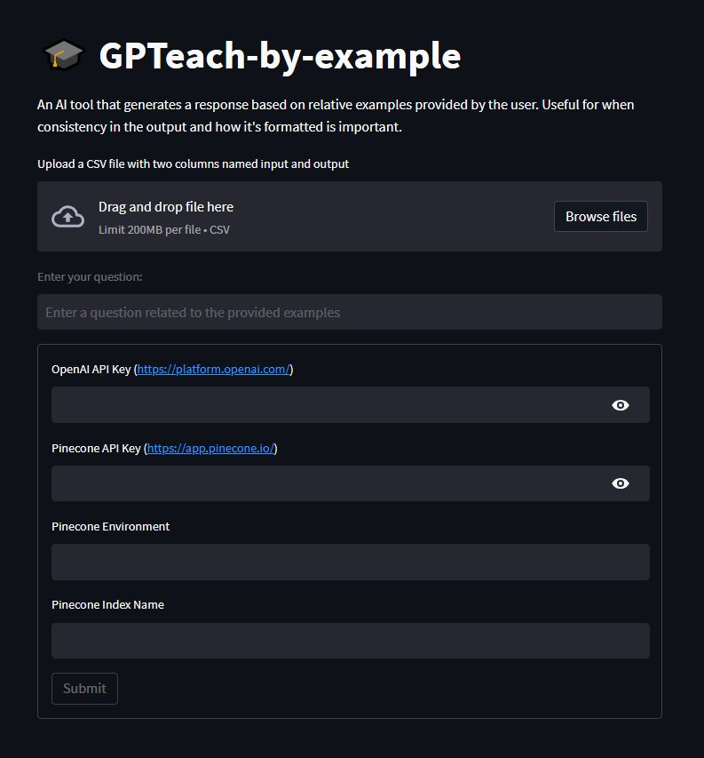

# 🎓 GPTeach-by-example

An AI tool that generates a response based on relative examples provided by the user. Useful for when consistency in the output and how it's formatted is important.

## How does it work?

1. Create a .csv file with two columns, first one named 'input' and second one named 'output'. Optionally use the existing examples.csv file in this repo.
2. Enter in as many examples in the .csv file as you'd like.
3. Upload the .csv file to the app.
4. The examples are converted into embeddings using OpenAI's embedding model and stored in the Pinecone vector store.
5. When submitting a question, langchain is used to embed the input and do a semantic similarity search over the vector store, which returns the top 3 results as context.
6. Then uses OpenAI's text-davinci-003 model and Langchain's few-shot dynamic prompt template to generate a response.

## Get an OpenAI API key

You can get your own OpenAI API key by following the following instructions:
1. Go to https://platform.openai.com/account/api-keys.
2. Click on the `+ Create new secret key` button.
3. Next, enter an identifier name (optional) and click on the `Create secret key` button.

## Get a Pinecone API key

You can get your own OpenAI API key by following the following instructions:
1. Go to https://app.pinecone.io/.
2. Click on the `API Keys` button on the left panel sidebar.
3. Click `+ Create API Key` button in the top right.
4. Next, enter an identifier name and click on the `Create Key` button.
5. Take note of the Environment listed next to your API key.

## Try out the app

1. git clone this repository
2. change directory to repo folder
3. run `pip install -r requirements.txt` in terminal to install required packages
4. run `streamlit run main.py` in terminal to load app in your default web browser
5. Once the app is loaded, go ahead and upload your examples, enter your API keys, and type a question in the text box and wait for a generated response.

or go to deployed app at https://gpteach-by-example.streamlit.app/

## Images

## To-Do

1. [ ] Add session state/chat history and conversation memory
2. [ ] Running example selector on existing vector store data instead of creating new embeddings every time
3. [ ] Option to add examples to existing vector store
4. [ ] Option to delete existing vector store index
5. [ ] Option to use OpenAI chat models
6. [ ] Option for user to choose model, edit prompt, and change k value
7. [ ] Add token usage/pricing information

Please feel free to contribute!